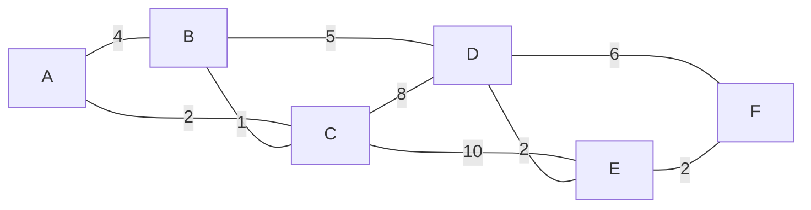

# EC441 Week 6 Lab Report: Link-State Routing and Dijkstra-Based Forwarding Simulation

## Artifact Type
Lab + Report

## Course Relevance
- Primary topic: Routing (link-state routing, Dijkstra shortest paths, forwarding tables)
- Stack layer coverage in this artifact: network layer
- Lecture connection: Lecture 15 discussion of link-state routing and Dijkstra-based forwarding

## Objective
This project implements a small link-state routing simulation in Python. The artifact turns the lecture idea of "each router learns the topology, then computes shortest paths locally" into a concrete workflow:

1. Model the network as a weighted graph.
2. Generate link-state advertisements (LSAs) for each router.
3. Flood LSAs so every router obtains the same topology database.
4. Run Dijkstra's algorithm from each router.
5. Build forwarding tables of destination, next hop, and path cost.
6. Recompute routes after a link failure and after a link-cost change.

## Research Questions
1. Can a router reconstruct the full topology from flooded LSAs?
2. Does Dijkstra's algorithm generate correct shortest paths and forwarding entries?
3. How does a forwarding table change after a link failure?
4. How does a forwarding table change when a link becomes cheaper?

## Background Concepts

### Graph Model
- Routers are graph nodes.
- Links are graph edges.
- Link cost is the edge weight.

### Link-State Routing
Each router advertises its directly connected links in an LSA. After flooding, every router has the same link-state database (LSDB), so each router can independently compute shortest paths without asking a central controller.

### Dijkstra's Algorithm
Dijkstra builds a shortest-path tree (SPT) from one source router by repeatedly selecting the not-yet-finalized node with smallest tentative distance and relaxing its outgoing edges.

### Forwarding Table
The full shortest path is useful for analysis, but real routers only need the first step. The forwarding table stores:

- Destination
- Next hop
- Total path cost

## Topology Used in the Simulation

Baseline topology:



The topology is intentionally small enough to inspect manually, but large enough to show non-trivial shortest-path choices.

## Implementation
- Language: Python 3
- Main file: `link_state_routing_sim.py`
- Libraries: Python standard library only

I originally proposed using `networkx`, but for this artifact I implemented Dijkstra manually so the routing logic is explicit and easy to inspect. This makes the submission more transparent and avoids dependency issues.

The script performs three scenarios:

1. **Baseline**: the original topology
2. **Link failure**: remove link `B-C`
3. **Cost change**: reduce link `A-B` cost from `4` to `1`

Generated outputs:
- `outputs/simulation_results.json`
- `outputs/router_A_tables.txt`

## Method
1. Build an undirected weighted graph from the baseline links.
2. Generate one LSA per router from its neighbor list.
3. Flood all LSAs and verify that each router receives the same LSDB.
4. Rebuild the topology from the flooded LSDB.
5. Run Dijkstra from every router.
6. Convert each shortest path into a forwarding-table entry using the first hop.
7. Repeat after a link failure and after a cost change.

## Results

### Baseline Forwarding Table for Router A

| Destination | Next Hop | Cost | Shortest Path |
|---|---|---:|---|
| B | C | 3 | A -> C -> B |
| C | C | 2 | A -> C |
| D | C | 8 | A -> C -> B -> D |
| E | C | 10 | A -> C -> B -> D -> E |
| F | C | 12 | A -> C -> B -> D -> E -> F |

Observation: the direct edge `A-B` has cost `4`, but the indirect path `A -> C -> B` costs `3`, so shortest paths are not always the physically shortest-looking links. This is exactly the kind of behavior link-state routing should capture.

### After Link Failure: Remove `B-C`

| Destination | Next Hop | Cost | Shortest Path |
|---|---|---:|---|
| B | B | 4 | A -> B |
| C | C | 2 | A -> C |
| D | B | 9 | A -> B -> D |
| E | B | 11 | A -> B -> D -> E |
| F | B | 13 | A -> B -> D -> E -> F |

Observation: once `B-C` fails, router A can no longer reach B through C, so several destinations switch to next hop `B`. The network still converges because alternate paths exist.

### After Cost Change: Reduce `A-B` from `4` to `1`

| Destination | Next Hop | Cost | Shortest Path |
|---|---|---:|---|
| B | B | 1 | A -> B |
| C | C | 2 | A -> C |
| D | B | 6 | A -> B -> D |
| E | B | 8 | A -> B -> D -> E |
| F | B | 10 | A -> B -> D -> E -> F |

Observation: lowering the cost of `A-B` causes a routing shift near the source router. Router A now prefers next hop `B` for B, D, E, and F, which shows how even one local metric change can reshape the forwarding table.

## Shortest-Path Tree for Router A

Baseline SPT edges:

| Parent | Child | Edge Cost | Distance from A |
|---|---|---:|---:|
| A | C | 2 | 2 |
| C | B | 1 | 3 |
| B | D | 5 | 8 |
| D | E | 2 | 10 |
| E | F | 2 | 12 |

This tree is what router A implicitly uses to extract next hops for all destinations.

## Analysis

### What the simulation demonstrates
- Flooding makes the LSDB identical across routers.
- Dijkstra converts the shared topology into shortest paths.
- Forwarding tables only need the first hop, even though the full path can be reconstructed.
- A single topology change can alter multiple forwarding entries.

### Why this matters
This is the core idea behind link-state routing protocols such as OSPF: global topology knowledge plus local shortest-path computation. The artifact shows how the control plane reacts to topology changes and how the data plane decision ("which next hop do I use?") follows from the recomputed SPT.

## Accuracy and Limitations
- The simulation assumes instant and reliable flooding.
- The graph is static within each scenario; real networks may change continuously.
- No packet-level timing or queueing is modeled.
- Equal-cost multipath (ECMP) is not implemented here, so each destination gets one preferred next hop.

## Reproducibility
Run from PowerShell:

```powershell
python .\link_state_routing_sim.py
```

Or specify a custom output directory:

```powershell
python .\link_state_routing_sim.py --output-dir .\outputs
```

On the local machine used for this submission, the working interpreter was:

```powershell
D:\anaconda\python.exe .\link_state_routing_sim.py
```

## Deliverables Included
- Python simulation code
- Markdown lab/report explanation
- Graph visualization (Mermaid topology diagram)
- Example forwarding tables
- Dynamic experiment with failure and cost change

## Engagement Reflection
This artifact goes beyond restating lecture notes. I implemented the routing logic directly, verified that flooding yields the same topology database at every router, and compared forwarding behavior before and after topology changes. That makes the connection between graph theory and practical forwarding decisions concrete.
